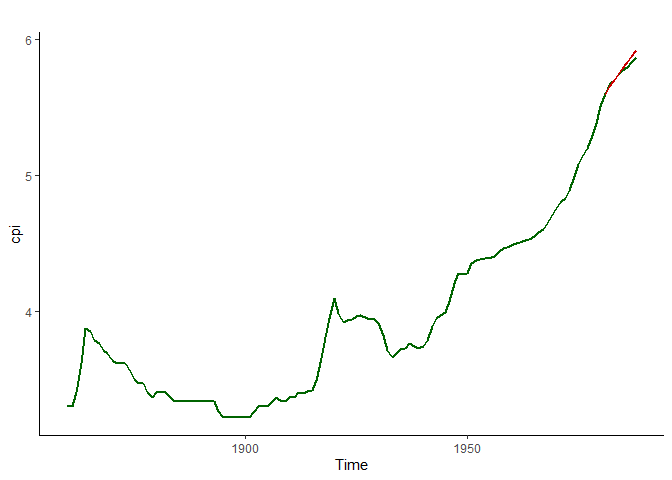

   

We will use the US Consumer Price Index (CPI) data set from the
*tseries* package.

The data set is part of *NelPlo data.*

    data(NelPlo, package = "tseries")
    head(cpi)

    ## Time Series:
    ## Start = 1860 
    ## End = 1865 
    ## Frequency = 1 
    ## [1] 3.295837 3.295837 3.401197 3.610918 3.871201 3.850148

    cpi <- ts(cpi,start = 1860, end = 1988)

## Test and Training Set

To understand which forecasting method performs the best it’s necessary
to evaluate them based on training and testing data. We take the last 8
years for testing data.

    library(tidyverse)

    ## Warning: package 'purrr' was built under R version 4.4.2

    ## Warning: package 'lubridate' was built under R version 4.4.3

    ## ── Attaching core tidyverse packages ───────────────── tidyverse 2.0.0 ──
    ## ✔ dplyr     1.1.4     ✔ readr     2.1.5
    ## ✔ forcats   1.0.0     ✔ stringr   1.5.1
    ## ✔ ggplot2   3.5.1     ✔ tibble    3.2.1
    ## ✔ lubridate 1.9.4     ✔ tidyr     1.3.1
    ## ✔ purrr     1.0.4     
    ## ── Conflicts ─────────────────────────────────── tidyverse_conflicts() ──
    ## ✖ dplyr::filter() masks stats::filter()
    ## ✖ dplyr::lag()    masks stats::lag()
    ## ℹ Use the conflicted package (<http://conflicted.r-lib.org/>) to force all conflicts to become errors

    library(tseries)

    ## Warning: package 'tseries' was built under R version 4.4.3

    ## 
    ##     'tseries' version: 0.10-58
    ## 
    ##     'tseries' is a package for time series analysis and
    ##     computational finance.
    ## 
    ##     See 'library(help="tseries")' for details.

    library(forecast)

    ## Warning: package 'forecast' was built under R version 4.4.1

    library(urca)

    ## Warning: package 'urca' was built under R version 4.4.1

    cpi <- ts(cpi,start = 1860, end = 1988)
    cpi.train <- window(cpi, end = 1980)
    cpi.test <- window(cpi, start = 1981)
    head(cpi.test)

    ## Time Series:
    ## Start = 1981 
    ## End = 1986 
    ## Frequency = 1 
    ## [1] 5.607122 5.666905 5.698524 5.740791 5.775783 5.794200

## ploting the data

It’s essential to plot the data to understand it. Plotting the data will
help to get idear about the nature of the data and the potential models
that can be applied.

    autoplot(cpi.train, linewidth = 1)+
      labs(tittle = "Consumer Price Index: Training Data",
           y= "",
           caption = "Source: C. R. Nelson and C. I. Plosser (1982),\n Trends and Random Walks in Macroeconomic Time Series. \n Journal of Monetary Economics, 10, 139–162.\n doi:10.1016/0304-3932(82)90012-5.")+
      scale_x_continuous(breaks= c(1860, 1900, 1950, 1988))+
      theme_classic()+
      theme(text = element_text(size = 20, family = "serif"),
            plot.caption = element_text(size = 7))

    ## Scale for x is already present.
    ## Adding another scale for x, which will replace the existing scale.

Let’s take first difference of the data to see whether the trend/ drift
goes away or not.

    autoplot(diff(cpi.train,2), linewidth = 1)+
      labs(title= expression(Delta^2 * "Consumer Price Index"), y = "",
                     caption = "Source: C. R. Nelson and C. I. Plosser (1982),\n Trends and Random Walks in Macroeconomic Time Series. \n Journal of Monetary Economics, 10, 139–162.\n doi:10.1016/0304-3932(82)90012-5.")+
      scale_x_continuous(breaks= c(1860, 1900, 1950, 1988))+
      theme_classic()+
      theme(text = element_text(size = 20, family = "serif"),
            plot.caption = element_text(size = 7))

    ## Scale for x is already present.
    ## Adding another scale for x, which will replace the existing scale.

Seems like differencing is making it trend stationary. Need to ensure
wheater the variable at level and/or variable at first difference has
unit root or not. Note: A series with unit root has time variant mean
and/or variance.

Now let’s explore the unit root, ACF and PACF to understand what will be
the potential values of p,d and q in the *ARIMA* model

    urca::ur.df(cpi.train,type = "drift") |>summary() # alternative tests are kpss, ers, pp, sp, za tests from the urca package

    ## 
    ## ############################################### 
    ## # Augmented Dickey-Fuller Test Unit Root Test # 
    ## ############################################### 
    ## 
    ## Test regression drift 
    ## 
    ## 
    ## Call:
    ## lm(formula = z.diff ~ z.lag.1 + 1 + z.diff.lag)
    ## 
    ## Residuals:
    ##       Min        1Q    Median        3Q       Max 
    ## -0.210887 -0.013672 -0.003596  0.014998  0.141449 
    ## 
    ## Coefficients:
    ##              Estimate Std. Error t value Pr(>|t|)    
    ## (Intercept) -0.018622   0.031539  -0.590    0.556    
    ## z.lag.1      0.006902   0.008197   0.842    0.402    
    ## z.diff.lag   0.601908   0.078320   7.685 5.38e-12 ***
    ## ---
    ## Signif. codes:  0 '***' 0.001 '**' 0.01 '*' 0.05 '.' 0.1 ' ' 1
    ## 
    ## Residual standard error: 0.04628 on 116 degrees of freedom
    ## Multiple R-squared:  0.3811, Adjusted R-squared:  0.3705 
    ## F-statistic: 35.72 on 2 and 116 DF,  p-value: 8.176e-13
    ## 
    ## 
    ## Value of test-statistic is: 0.842 1.8483 
    ## 
    ## Critical values for test statistics: 
    ##       1pct  5pct 10pct
    ## tau2 -3.46 -2.88 -2.57
    ## phi1  6.52  4.63  3.81

The unit root test (Null: The series has unit root.) shows that CPI has
unit root at level.

    urca::ur.df(diff(cpi.train),type = "drift") |>summary() 

    ## 
    ## ############################################### 
    ## # Augmented Dickey-Fuller Test Unit Root Test # 
    ## ############################################### 
    ## 
    ## Test regression drift 
    ## 
    ## 
    ## Call:
    ## lm(formula = z.diff ~ z.lag.1 + 1 + z.diff.lag)
    ## 
    ## Residuals:
    ##       Min        1Q    Median        3Q       Max 
    ## -0.200573 -0.014820 -0.000801  0.019576  0.119296 
    ## 
    ## Coefficients:
    ##              Estimate Std. Error t value Pr(>|t|)    
    ## (Intercept)  0.008329   0.004295   1.939   0.0549 .  
    ## z.lag.1     -0.473913   0.079481  -5.963 2.79e-08 ***
    ## z.diff.lag   0.253094   0.089841   2.817   0.0057 ** 
    ## ---
    ## Signif. codes:  0 '***' 0.001 '**' 0.01 '*' 0.05 '.' 0.1 ' ' 1
    ## 
    ## Residual standard error: 0.04422 on 115 degrees of freedom
    ## Multiple R-squared:  0.2362, Adjusted R-squared:  0.2229 
    ## F-statistic: 17.78 on 2 and 115 DF,  p-value: 1.864e-07
    ## 
    ## 
    ## Value of test-statistic is: -5.9626 17.7772 
    ## 
    ## Critical values for test statistics: 
    ##       1pct  5pct 10pct
    ## tau2 -3.46 -2.88 -2.57
    ## phi1  6.52  4.63  3.81

The test result shows that the first differnce series dos not have unit
root.

    Acf(diff(cpi.train))

    Pacf(diff(cpi.train))

Seems like ARIMA(2,1,2) can be a good choice with two significant spikes
in each of the plots. Let’s see what does *auto.arima()* say.

    cpi.fit.auto.arima <- auto.arima(cpi.train, seasonal = F)

## forecast using auto.arima

    forecast.auto.arima <- cpi.fit.auto.arima%>% forecast(h = 8)
    autoplot(cpi, color = "darkgreen", size =1, series = "CPI")+
      autolayer(forecast.auto.arima, PI =F, color = "darkred", size = 1, series = "Arima Prediction")+
      theme_classic()

Notice that the forecasted values are very close to the real values.
Remember that the last 8 years were not used in training. Seems a good
fit. Let’s evaluate the fit.

## ARIMA fit Evaluation

    accuracy(forecast.auto.arima, cpi.test) %>% round(3)

    ##                  ME  RMSE   MAE    MPE  MAPE  MASE   ACF1 Theil's U
    ## Training set  0.002 0.044 0.028  0.046 0.724 0.696 -0.015        NA
    ## Test set     -0.015 0.027 0.021 -0.260 0.366 0.537  0.680     0.728

NOt a bad result. Let’s fit some other models and compare them.

## Holt’s Exponential Smoothing

Since no seasonality is possible for the data under study, we will use a
simple Holt’s model.

    cpi.fit.holt <- holt(cpi.train, h = 10)
    accuracy(cpi.fit.holt, cpi.test) %>% round(3)

    ##                  ME  RMSE  MAE    MPE  MAPE  MASE  ACF1 Theil's U
    ## Training set  0.001 0.050 0.03  0.040 0.805 0.771 0.078        NA
    ## Test set     -0.320 0.379 0.32 -5.521 5.521 8.089 0.642    10.149

    forecast.holt <- forecast(cpi.fit.holt,h = 8)
    autoplot(cpi, color = "darkgreen", size =1, series = "CPI")+
      autolayer(forecast.auto.arima, PI =F, color = "darkred", size = 1, series = "Arima Prediction")+
      autolayer(forecast.holt, size= 1, color = "blue", PI = F)+
      theme_classic()

 Let’s
get to the damped Holt’s model

    cpi.fit.holt.damped <- holt(cpi.train, h = 10,damped = T)
    accuracy(cpi.fit.holt.damped, cpi.test) %>% round(3)

    ##                 ME  RMSE   MAE   MPE  MAPE  MASE  ACF1 Theil's U
    ## Training set 0.005 0.050 0.032 0.105 0.841 0.813 0.239        NA
    ## Test set     0.023 0.026 0.023 0.394 0.394 0.574 0.230     0.667

    forecast.holt.damped <- forecast(cpi.fit.holt,h = 8)
    autoplot(cpi, color = "darkgreen", size =1, series = "CPI")+
      autolayer(forecast.auto.arima, PI =F, color = "darkred", size = 1, series = "Arima Prediction")+
      autolayer(forecast.holt, size= 1, color = "blue", PI = F)+
      autolayer(forecast.holt.damped, size= 1, linetype = 3, color = "purple", PI = F)+
      theme_classic()

The damped model predicted the same as the usual model. So far the ARIMA
seems a better fit. Note: we could use the ets() function here.

This line is a trial commit.
